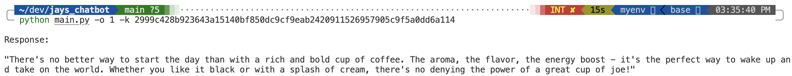
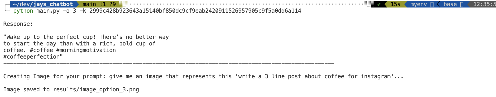
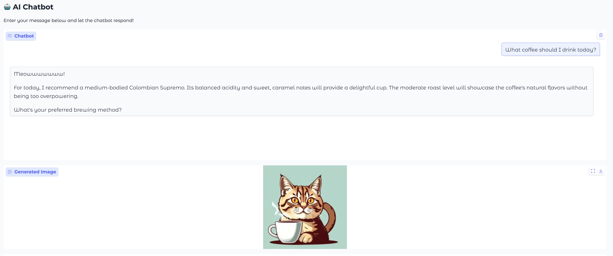

# jays_chatbot
### Instructions to run this program
### 1st task
`
python main.py -o 1 -k YOUR_TOGETHER_API_KEY
`
### Result:

### 2nd task
`
python main.py -o 2 -k YOUR_TOGETHER_API_KEY
`

### Result:

### 3rd task
`
python main.py -o 3 -k YOUR_TOGETHER_API_KEY
`

### Result:

### 4th task
`
python main.py -o 4 -k YOUR_TOGETHER_API_KEY
`
### Result:
